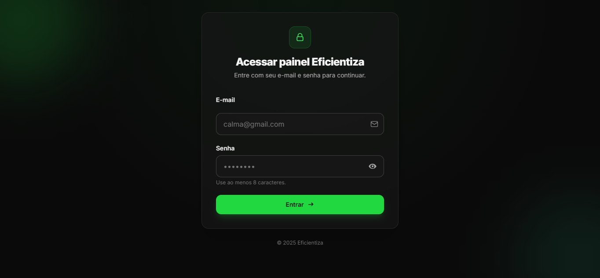
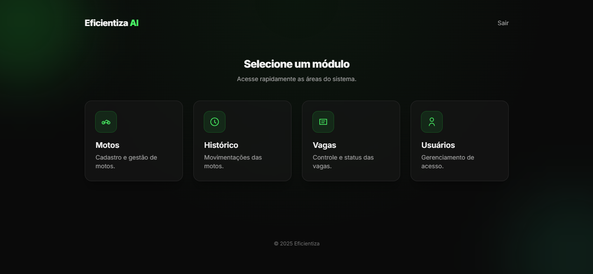
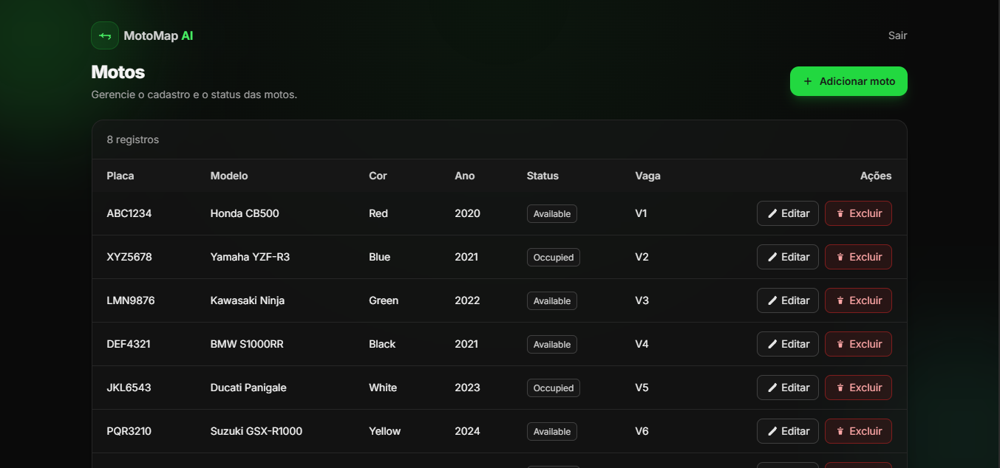
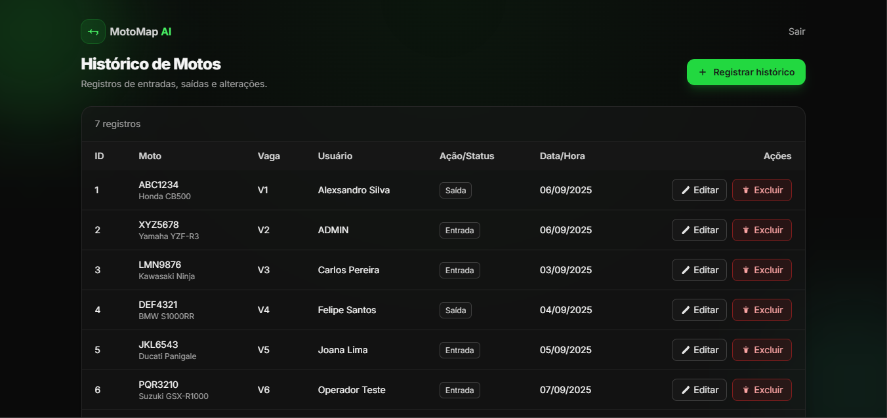
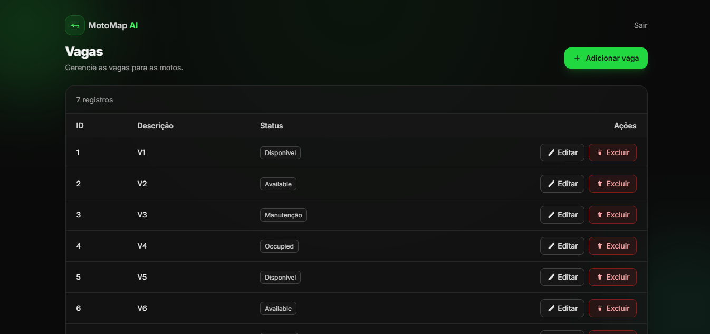
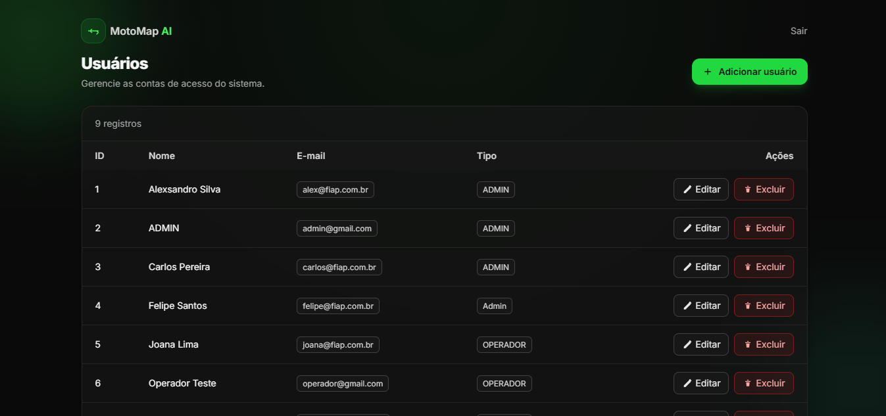

# 🏍️ Eficientiza - Sistema de Gestão para Mottu

## 👥 Integrantes
- **Alexsandro Macedo**: RM557068
- **Leonardo Faria Salazar**: RM557484  
- **Guilherme Felipe da Silva Souza**: RM558282

## 📺 Demonstração
- **🎥 Vídeo**: [https://www.youtube.com/watch?v=50km-H_-zv0](https://www.youtube.com/watch?v=50km-H_-zv0)
- **🔗 Azure DevOps**: [https://dev.azure.com/RM558282/Devops_sprint4](https://dev.azure.com/RM558282/Devops_sprint4)

## 📋 Descrição

O **Eficientiza** é um sistema completo de gestão de frota desenvolvido para a **Mottu**, implementando práticas modernas de **DevOps** e **Cloud Computing**. A solução permite o gerenciamento inteligente de motos, vagas e usuários com deploy contínuo automatizado.

## 🚀 Acesso ao Sistema

**Credenciais:**
- **👑 ADMIN**: `admin@gmail.com` / `admin`
- **🔧 OPERADOR**: `operador@gmail.com` / `operador`

## 🎯 Funcionalidades Principais
- **🏍️ Gestão de Motos** - Cadastro completo com placa, modelo, status e vaga
- **🅿️ Controle de Vagas** - Sistema inteligente de alocação e monitoramento
- **📊 Histórico de Operações** - Rastreamento completo de todas as movimentações
- **👥 Gestão de Usuários** - Controle de acesso com perfis ADMIN e OPERADOR
- **🔐 Autenticação Segura** - Spring Security com roles e criptografia

## 🛠 Stack Tecnológica

### 💻 Backend
- **Java 17** + **Spring Boot 3.5.6**
- **Spring Security** - Autenticação e autorização
- **Spring Data JPA** - Persistência de dados
- **Hibernate** - ORM
- **Maven** - Gerenciamento de dependências

### 🎨 Frontend
- **Thymeleaf** - Template engine
- **HTML5** + **CSS3** + **JavaScript**
- **Bootstrap 5** - Framework CSS

### ☁️ Infraestrutura & DevOps
- **Azure App Service** - Hospedagem da aplicação
- **Azure SQL Database** - Banco de dados em nuvem
- **Azure DevOps** - Pipelines CI/CD
- **GitHub** - Versionamento e repositório
- **Azure CLI** - Automação de infraestrutura

### 🧪 Testes & Qualidade
- **JUnit 5** - Testes unitários e de integração
- **H2 Database** - Banco em memória para testes
- **Maven Surefire** - Execução de testes automatizados

## 📁 Estrutura do Projeto
```
src/
├── main/
│ ├── java/br/com/fiap/eficientiza_challenge_03/
│ │ ├── controller/ # 🎮 Controladores REST
│ │ ├── model/ # 🏗️ Entidades JPA
│ │ ├── repository/ # 💾 Repositórios de dados
│ │ ├── service/ # ⚙️ Lógica de negócio
│ │ └── config/ # ⚙️ Configurações Spring
│ └── resources/
│ ├── templates/ # 🎨 Páginas Thymeleaf
│ ├── static/ # 🎨 CSS, JS, Imagens
│ └── application.properties
└── test/
├── java/ # 🧪 Testes unitários
└── resources/
└── application-test.properties # 🧪 Config testes
```

## ⚙️ Configurações

### 🔧 application.properties (Produção)
```properties
# Database Azure SQL
spring.datasource.url=${DATABASE_URL}
spring.datasource.username=${DATABASE_USERNAME}
spring.datasource.password=${DATABASE_PASSWORD}

# JPA Config
spring.jpa.hibernate.ddl-auto=update
spring.jpa.show-sql=true

# Flyway (desativado)
spring.flyway.enabled=false

# App Config
server.port=8080
```

### 🧪 application-test.properties (Testes)
```
# H2 Database para testes
spring.datasource.url=jdbc:h2:mem:testdb
spring.datasource.driver-class-name=org.h2.Driver
spring.jpa.hibernate.ddl-auto=create-drop
```

## 🚀 Como Executar 1️⃣ Localmente (Desenvolvimento)
```
# Clone o repositório
git clone [https://github.com/GuiFelSS/Devops_sprint4.git](https://github.com/GuiFelSS/Devops_sprint4.git)
cd Devops_sprint4

# Instale as dependências
mvn clean install

# Execute a aplicação
mvn spring-boot:run

# Acesse: http://localhost:8080
```

### 2️⃣ Executar Testes
```
# Executar todos os testes
mvn test

# Executar com perfil de teste
mvn test -Dspring.profiles.active=test
```

## 🔄 Pipeline CI/CD  
### 📦 CI Pipeline (Azure DevOps)
**Trigger:** Push para branch master

**Tasks:**
- Maven Build - clean package (Java 17)
- Test Execution - Execução automática de testes
- Publish Artifact - Empacotamento do JAR

### 🚀 CD Pipeline (Azure DevOps)
**Trigger:** CI bem-sucedida

**Tasks:**
- Azure App Service Deploy - Implantação automática
- Environment Configuration - Variáveis de ambiente
- Health Check - Validação do deploy

## 🗃️ Modelo deDados
### 🏍️ Entidade Moto
```java
- id_moto, ds_placa, nm_modelo, ds_cor
- nr_ano, ds_status, ds_vaga
```

### 🅿️ Entidade Vaga
```
- id_vaga, ds_vaga, ds_status, id_moto
```

### 👤 Entidade Usuario
```
- id_usuario, nm_usuario, ds_email
- ds_senha, tp_usuario
```

### 📋 Entidade HistoricoMoto
```
- id_historico, id_moto, id_usuario
- tp_acao, dt_acao
```

## 🛡️ Segurança
- 🔐 Spring Security com autenticação por formulário
- 👥 Dois perfis: ADMIN (acesso total) e OPERADOR (acesso restrito)
- 🔒 Senhas criptografadas com encoding adequado
- 🛡️ Proteção CSRF habilitada
- 📋 Validação de inputs em todos os formulários

## Imagens do sistema






